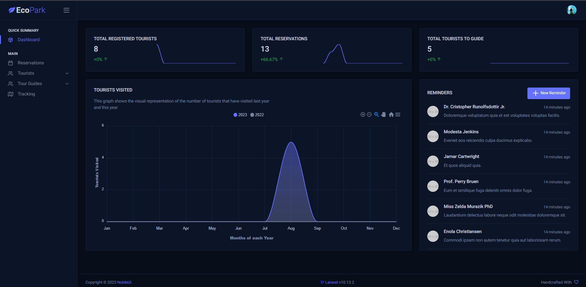
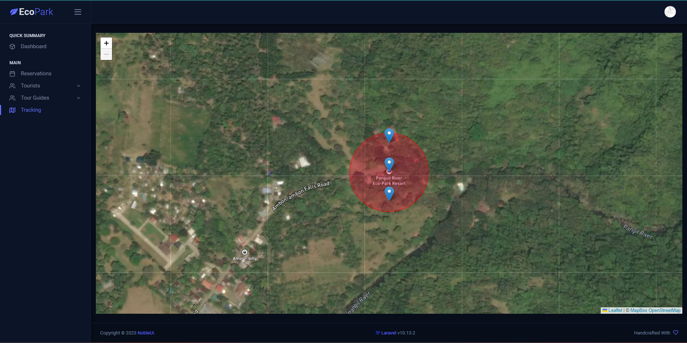

<p align="center"><a href="https://laravel.com" target="_blank"></a></p>
<h1 align="center" style="border-bottom:none; margin-bottom: 80px;">Panguil EcoPark and Resort Admin System</h1>

## About this project

This is a web-based admin system for Panguil EcoPark and Resort which is made using Laravel + Vite and Bootstrap. The admin dashboard template used was from <a href="https://www.nobleui.com">NobleUI.com</a>. This system features:

- Quick summaries of total tourists visited in the current year and previous year, registered tourists, reservations and assigned tourists.
- The dashboard itself also shows the reminders
- Complete list of registered tourists
- Complete list of reservations
- Complete list of tour guides
- Live map tracking of users

This admin system was built and made specifically for Panguil EcoPark and Resort so that it will be easier for them to keep track of their data and manage each tourist and tour guides' informations.

## Techs Used
- **[Laravel v10.xx](https://laravel.com)**
- **[Pusher.JS](https://pusher.com)**
- **[Vite.JS](https://vitejs.dev)**
- **[Leaflet.JS](https://leafletjs.com)**
- **[Mapbox Tiles](https://mapbox.com)**
- **[Bootstrap 5](https://getbootstrap.com)**
- **[NobleUI Admin Template](https://nobleui.com)**

## Project Preview






## Building Project

Download dependencies:

```
composer install
npm install
```

Run artisan command:

```
php artisan key:generate
```

Next, open `.env` file and find and replace these keys' values with your own [pusher](https://pusher.com) account credentials and database credentials:

```
DB_DATABASE=[YOUR DATABASE NAME]
DB_USERNAME=[YOUR DATABASE USERNAME]
DB_PASSWORD=[YOUR DATABASE PASSWORD]

PUSHER_APP_ID=[YOUR PUSHER APP ID]
PUSHER_APP_KEY=[YOUR PUSHER APP KEY]
PUSHER_APP_SECRET=[YOUR PUSHER APP SECRET]
```

Next, run migration to generate all the tables:

```
php artisan migrate
```

Next, run this command to create a default admin account for the system:

```
php artisan app:create-admin
```

The default admin email address and password is:

```
Email: tatel@gmail.com
Password: test123
```

Next, run this command twice (*for some reason it doesn't take effect by running once*) if you want to run the system in development mode:

```
php artisan app:run-as-dev
```

Hit `Ctrl+C` to stop and then execute it again. Then it will work, then just open `http://localhost:8000` in your browser. By default, the system is hosted on port `8000`.

To run the system in production mode, you just do the same thing but with this command:

```
php artisan app:run-as-prod
```

*Note: When executing `php artisan app:run-as-dev` and `php artisan app:run-as-prod` while in __production mode__, you will be prompted in the console. When that happens, just type `yes` on each prompts and press `Enter`.*


<p align="center"><a href="https://laravel.com" target="_blank"></a></p>

<p align="center">
<a href="https://github.com/laravel/framework/actions"></a>
<a href="https://packagist.org/packages/laravel/framework"></a>
<a href="https://packagist.org/packages/laravel/framework"></a>
<a href="https://packagist.org/packages/laravel/framework"></a>
</p>

## About Laravel

Laravel is a web application framework with expressive, elegant syntax. We believe development must be an enjoyable and creative experience to be truly fulfilling. Laravel takes the pain out of development by easing common tasks used in many web projects, such as:

- [Simple, fast routing engine](https://laravel.com/docs/routing).
- [Powerful dependency injection container](https://laravel.com/docs/container).
- Multiple back-ends for [session](https://laravel.com/docs/session) and [cache](https://laravel.com/docs/cache) storage.
- Expressive, intuitive [database ORM](https://laravel.com/docs/eloquent).
- Database agnostic [schema migrations](https://laravel.com/docs/migrations).
- [Robust background job processing](https://laravel.com/docs/queues).
- [Real-time event broadcasting](https://laravel.com/docs/broadcasting).

Laravel is accessible, powerful, and provides tools required for large, robust applications.

## Learning Laravel

Laravel has the most extensive and thorough [documentation](https://laravel.com/docs) and video tutorial library of all modern web application frameworks, making it a breeze to get started with the framework.

You may also try the [Laravel Bootcamp](https://bootcamp.laravel.com), where you will be guided through building a modern Laravel application from scratch.

If you don't feel like reading, [Laracasts](https://laracasts.com) can help. Laracasts contains over 2000 video tutorials on a range of topics including Laravel, modern PHP, unit testing, and JavaScript. Boost your skills by digging into our comprehensive video library.

## Laravel Sponsors

We would like to extend our thanks to the following sponsors for funding Laravel development. If you are interested in becoming a sponsor, please visit the Laravel [Patreon page](https://patreon.com/taylorotwell).

### Premium Partners

- **[Vehikl](https://vehikl.com/)**
- **[Tighten Co.](https://tighten.co)**
- **[Kirschbaum Development Group](https://kirschbaumdevelopment.com)**
- **[64 Robots](https://64robots.com)**
- **[Cubet Techno Labs](https://cubettech.com)**
- **[Cyber-Duck](https://cyber-duck.co.uk)**
- **[Many](https://www.many.co.uk)**
- **[Webdock, Fast VPS Hosting](https://www.webdock.io/en)**
- **[DevSquad](https://devsquad.com)**
- **[Curotec](https://www.curotec.com/services/technologies/laravel/)**
- **[OP.GG](https://op.gg)**
- **[WebReinvent](https://webreinvent.com/?utm_source=laravel&utm_medium=github&utm_campaign=patreon-sponsors)**
- **[Lendio](https://lendio.com)**

## Contributing

Thank you for considering contributing to the Laravel framework! The contribution guide can be found in the [Laravel documentation](https://laravel.com/docs/contributions).

## Code of Conduct

In order to ensure that the Laravel community is welcoming to all, please review and abide by the [Code of Conduct](https://laravel.com/docs/contributions#code-of-conduct).

## Security Vulnerabilities

If you discover a security vulnerability within Laravel, please send an e-mail to Taylor Otwell via [taylor@laravel.com](mailto:taylor@laravel.com). All security vulnerabilities will be promptly addressed.

## License

The Laravel framework is open-sourced software licensed under the [MIT license](https://opensource.org/licenses/MIT).
